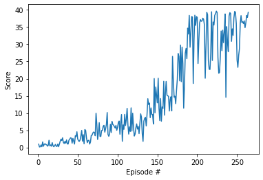

# Udacity project joint arm

## Udacity project for Joint Arm

Reinforcement Learning Agent for Joint Arm using Deep Deterministic Policy Gradient (DDPG)

### Project description

In this environment, a double-jointed arm can move to target locations. A reward of +0.1 is provided for each step that the agent's hand is in the goal location. Thus, the goal of your agent is to maintain its position at the target location for as many time steps as possible.

The observation space consists of 33 variables corresponding to position, rotation, velocity, and angular velocities of the arm. Each action is a vector with four numbers, corresponding to torque applicable to two joints. Every entry in the action vector should be a number between -1 and 1.

Distributed Training
For this project, we will provide you with two separate versions of the Unity environment:

The first version contains a single agent.
The second version contains 20 identical agents, each with its own copy of the environment.
The second version is useful for algorithms like PPO, A3C, and D4PG that use multiple (non-interacting, parallel) copies of the same agent to distribute the task of gathering experience.

Solving the Environment
Note that your project submission need only solve one of the two versions of the environment.

Option 1: Solve the First Version
The task is episodic, and in order to solve the environment, your agent must get an average score of +30 over 100 consecutive episodes.

Option 2: Solve the Second Version
The barrier for solving the second version of the environment is slightly different, to take into account the presence of many agents. In particular, your agents must get an average score of +30 (over 100 consecutive episodes, and over all agents). Specifically,

### Solution

This project has been solved on a Jupyter notebook 

Follow the instructions in `Continuous_Control_DDPG.ipynb` to get started with training your own agent!  

See `Report.ipynb` for analysis of input hyperparameters (learning rates, etc) and output.

#### Results (rewards):

### Requirements
#### Libraries:
* pip install unityagents
* pip install numpy
* pip install matplotlib
* install pytorch following the instructions on the pytorch website: https://pytorch.org/get-started/locally/

##### You will need the folder named: Reacher_Windows_x86_64 and the jupyter notebook named Continuous_Control_DDPG.ipynb

* For this project you might not need to install Unity3D. This is because the files for the environment were provided by the Udacity Nano degree in Deep reinforcement learning.
* Make sure to uncompressed the file 'Reacher_Windows_x86_64.zip'

#### For mac
Use 'Reacher.app.zip' instead of 'Reacher_Windows_x86_64.zip'

#### For Linux
Use 'Reacher_Linux.zip' instead of 'Reacher_Windows_x86_64.zip'
